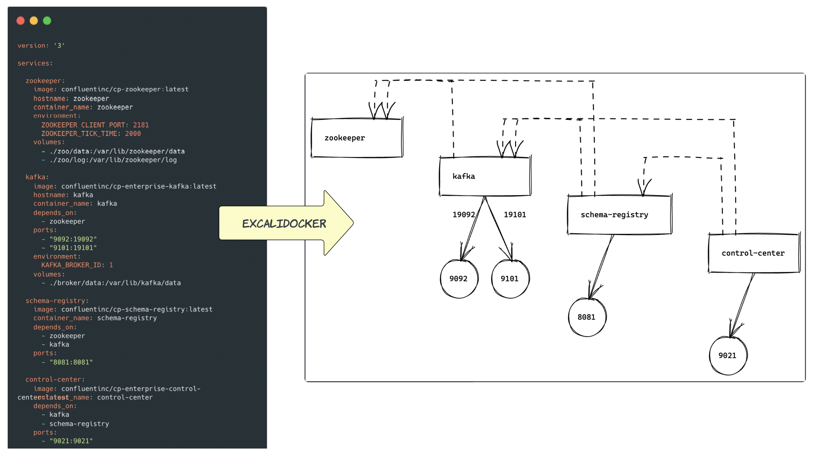

# excalidocker-rs
Rust-based utility to convert docker-compose.yaml files into [excalidraw](https://excalidraw.com/) files.


# Table of Contents
1. [Motivation](#motivation)
2. [Usage](#usage)
3. [Installation](#installation)
4. [Contributing](#contributing)
5. [Roadmap](#roadmap)

## Motivation
An idea of writing this utility originates from Robin Moffatt's [tweet](https://twitter.com/rmoff/status/1659214185220423685).


## Usage
### Docker image
`excalidocker` is available as a 🐳 [docker image](https://hub.docker.com/r/etolbakov/excalidocker/tags). An image usage example command:
 ```sh
docker run --rm -v "$(pwd)/data/compose/:/tmp/" -e INPUT_PATH=/tmp/docker-compose.yaml etolbakov/excalidocker:0.1.3-20230606 > produced-by-image.excalidraw
```
The `produced-by-image.excalidraw` file could be opened in [excalidraw](https://excalidraw.com/) and.... hopefully it won't be too shocking 👻 😅.

Convert docker-compose files without installing/building. Use it in things like github actions for auto documentation. The sky is the limit.

### Artifact
Download the latest artifact(🐧 / ) from [releases](https://github.com/etolbakov/excalidocker-rs/releases) and ungzip it.

To get the `help` menu use:
```sh
./excalidocker -h
```
The output should be similar to:
```sh
Utility to convert docker-compose into excalidraw

Usage: excalidocker [OPTIONS] --input-path <INPUT_PATH>

Options:
  -i, --input-path <INPUT_PATH>    file path to the docker-compose.yaml
  -s, --skip-dependencies          display connecting lines between services; if `true` then only service without the lines are rendered
  -o, --output-path <OUTPUT_PATH>  file path for the output excalidraw file. By default the file content is sent to console output
  -h, --help                       Print help
  -V, --version                    Print version
```

An artifact usage example command:
```sh
./excalidocker --input-path /your/path/docker-compose.yaml --output-path /your/path/result.excalidraw
```

> **Warning**
>
> On the first launch the ungzipped artifact I saw the following pop up
> "Mac cannot be opened because it is from an unidentified developer"
> If you are fine with that you can `Control-click` the artifact, then choose `Open` from the shortcut menu.
> Click `Open`. The utility will be saved as an exception to your security settings,
> and you can open it in the future by double-clicking it just as you can any registered app.
>
> 


## Installation
To build `excalidocker` locally, please follow these steps:

1. Install Rust and Cargo if you haven't already. Refer to the official Rust documentation for [installation instructions](https://www.rust-lang.org/tools/install):
2. Clone this repository:
```shell
git clone https://github.com/etolbakov/excalidocker-rs.git
```
3. Build the project using Cargo:
```shell
cd excalidocker-rs && cargo build --release
```
There is the `make r` command available in the [Makefile](/Makefile) along with other useful command shortcuts.


## Roadmap
These are the features that I would like to add at some point:
- 📊 visualize more data from a docker-compose file - volumes, network, etc
- 🎨 colour output
- 🦀 various code improvements/enhancements. Feel free to review/suggest if anything could be done better!
- 👨‍💻 etc

## Contributing

Contributions are welcome! If you encounter any issues or have suggestions for improvements, please open an issue or submit a pull request.

## License

This project is licensed under the [MIT License](./LICENSE).
Feel free to customize the text based on your project's specific details, such as repository URLs, installation instructions, and contribution guidelines.
