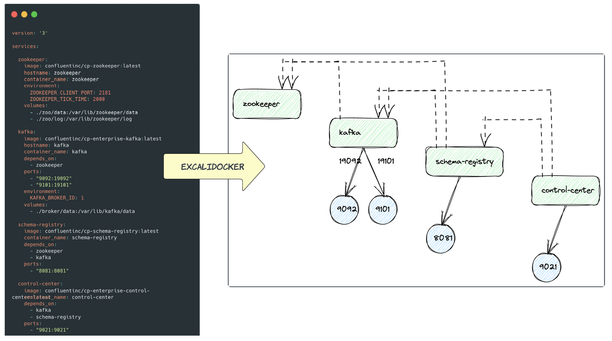
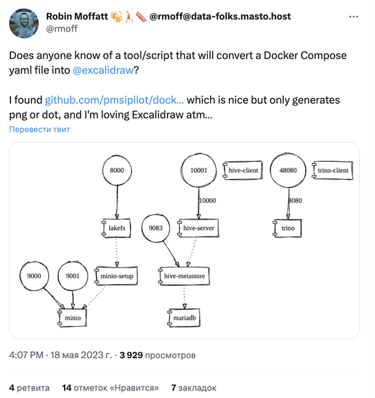
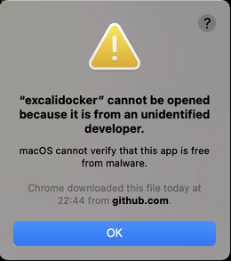

# excalidocker-rs
[](LICENSE)
❘


❘
[](https://github.com/etolbakov/excalidocker-rs/graphs/commit-activity)
[](https://github.com/etolbakov/excalidocker-rs/issues?q=is%3Aissue+is%3Aclosed)


Rust-based utility to convert docker-compose.yaml files into [excalidraw](https://excalidraw.com/) files.


Key features
=================
 - Transform your **local docker-compose** files into excalidraw with just a single `docker run` command. Showcase your infrastructure designs in a visually appealing and engaging format.
 - Convert **external docker-compose** files into excalidraw by simply providing a Github link. Easy to share and collaborate.
 - Available for **installation** on both Linux and MacOS platforms (amd64/arm64). Could be installed via 🍺 `brew` and 🐳 `docker`.
 - Design **customization**. Tailor your infrastructure diagrams to your specific needs by customizing alignment(vertical, horizontal, stepped), font, background colours, styles, etc.

### Demo 🎥 
If a picture is worth a thousand words, then is a video worth a million?


Usage examples could be found [here](./data/examples.md).

Table of contents
=================
<!--ts-->
   * [Motivation](#motivation)
   * [Usage](#usage)
      * [Docker image](#docker-image)
      * [Brew](#brew)
      * [Binaries](#binaries)
      * [Config file](#config-file)
   * [Installation](#installation)
   * [Contributing](#contributing)
   * [Roadmap](#roadmap)
<!--te-->

## Motivation
The idea of writing this utility originates from Robin Moffatt's [tweet](https://twitter.com/rmoff/status/1659214185220423685).


## Usage
### Docker image
🐳 `excalidocker` is available as a [Docker image](https://hub.docker.com/r/etolbakov/excalidocker/tags).
Convert docker-compose files without hassle. Use as a Github action step for documentation, presentations, [ADRs](https://adr.github.io/) what have you.
The sky is the limit. 

Convert a _local_ file:

 ```sh
docker run --rm --pull always \
           -v "$(pwd)/data/compose/:/tmp/" \
           -e INPUT_PATH=/tmp/docker-compose.yaml \
           etolbakov/excalidocker:latest \
           > produced-by-image.excalidraw
```

Convert an _external_ file:

```sh
docker run --rm --pull always \
           -e INPUT_PATH=https://github.com/apache/pinot/blob/master/docker/images/pinot/docker-compose.yml \
           etolbakov/excalidocker:latest \
           > produced-by-image-remote.excalidraw
```

The produced `excalidraw` file can be opened in [excalidraw](https://excalidraw.com/) and .... hopefully it won't be too scary 👻 😅.

<details>
  <summary>Convert a local file proving a config</summary>
  
  The command below shows how to pass the config file for additional customization

  ```sh
   docker run --rm --pull always \
             -v "$(pwd)/data/compose/:/tmp/" \
             -v "$(pwd)/excalidocker-config.yaml:/tmp/excalidocker-config.yaml" \
             -e INPUT_PATH=/tmp/docker-compose.yaml \
             -e CONFIG_PATH=/tmp/excalidocker-config.yaml \
             etolbakov/excalidocker:latest \
             > produced-by-image-config-deps.excalidraw
  ```
</details>

More command examples could be found either in the [Makefile](/Makefile) or in the [examples](./data/examples.md).
### Brew
To install `excalidocker` with `brew` run the following command: 
```
brew install etolbakov/taps/excalidocker
```
To uninstall:
```
brew uninstall etolbakov/taps/excalidocker
```

### Binaries
📚 Download the latest pre-compiled binaries for your platform/architecture from [releases](https://github.com/etolbakov/excalidocker-rs/releases) and ungzip it.

```sh
OS=linux
ARCH=amd64
tar -xvzf excalidocker-${OS}-${ARCH}.tgz
chmod +x excalidocker
sudo mv excalidocker /usr/local/bin
```

To get the `help` menu use:
```sh
excalidocker -h
```
The output should be similar to:
```sh
Utility to convert docker-compose into excalidraw

Usage: 
excalidocker 0.1.7
    ╰→ excalidocker --input-path <INPUT_PATH>
    ╰→ excalidocker --show-config

Options:
  -C, --show-config                show configuration file
  -i, --input-path <INPUT_PATH>    file path to the docker-compose.yaml
  -s, --skip-dependencies          display connecting lines between services; if `true` then only service without the lines are rendered
  -o, --output-path <OUTPUT_PATH>  file path for the output excalidraw file. By default the file content is sent to console output
  -c, --config-path <CONFIG_PATH>  config file path for the excalidraw [default: excalidocker-config.yaml]
  -h, --help                       Print help
  -V, --version                    Print version
```
Convert docker to excalidraw:
```sh
excalidocker --input-path /your/path/docker-compose.yaml --output-path /your/path/result.excalidraw
```
Create a configuration file for further customization:
```sh
excalidocker --show-config > sample-config.yaml
```

> **Warning**
>
> On the first launch the ungzipped artifact I saw the following pop up
> "Mac cannot be opened because it is from an unidentified developer"
> If you are fine with that you can `Control-click` the artifact, then choose `Open` from the shortcut menu.
> Click `Open`. The utility will be saved as an exception to your security settings,
> and you can open it in the future by double-clicking it just as you can any registered app.
>
> 

### Config file
🎨 `excalidocker` supports basic customization provided via file, for example [excalidocker-config.yaml](./excalidocker-config.yaml).
At the moment it's possible to customize:
 - alignment mode (`stepped`(default), `vertical`, `horizontal`)
 - font size and type
 - fill type (`hachure`, `cross-hatch`, `solid`) 
 - background colours for services and ports. Both hex / [colour names](https://github.com/etolbakov/excalidocker-rs/blob/main/src/color_utils.rs) are supported.
 - edge type (`sharp`, `round`)
 - enable/disable connections (has the same effect as `--skip-dependencies` cli option)

## Installation
To build `excalidocker` locally, please follow these steps:

1. Install Rust and Cargo if you haven't already. Refer to the official Rust documentation for [installation instructions](https://www.rust-lang.org/tools/install):
2. Clone this repository:
```sh
git clone https://github.com/etolbakov/excalidocker-rs.git
```
3. Build the project using Cargo:
```sh
cd excalidocker-rs && cargo build --release
```
There is the `make r` command available in the [Makefile](/Makefile) along with other useful command shortcuts.

## Roadmap
These are the features that I would like to add at some point:
- 📊 visualize more data from a docker-compose file - volumes, network, etc
- 🦀 various code improvements/enhancements. Feel free to review/suggest if anything could be done better!
- 👨‍💻 etc

## Contributing

Contributions are welcome! If you encounter any issues, have suggestions for improvements or would like to [participate](https://github.com/etolbakov/excalidocker-rs/issues) please open an issue or submit a pull request.

## License

This project is licensed under the [MIT License](./LICENSE).
Feel free to customize the text based on your project's specific details, such as repository URLs, installation instructions, and contribution guidelines.
